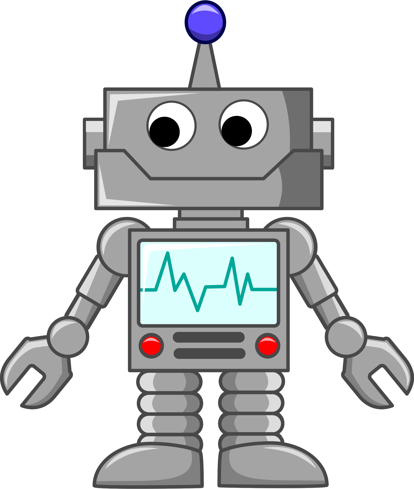

## What Is A Robot?
Robots are machines that are able to carry out, or perform their own actions after being set/programmed to do so. Robots are developing technology that make our lives easier and better.

 
